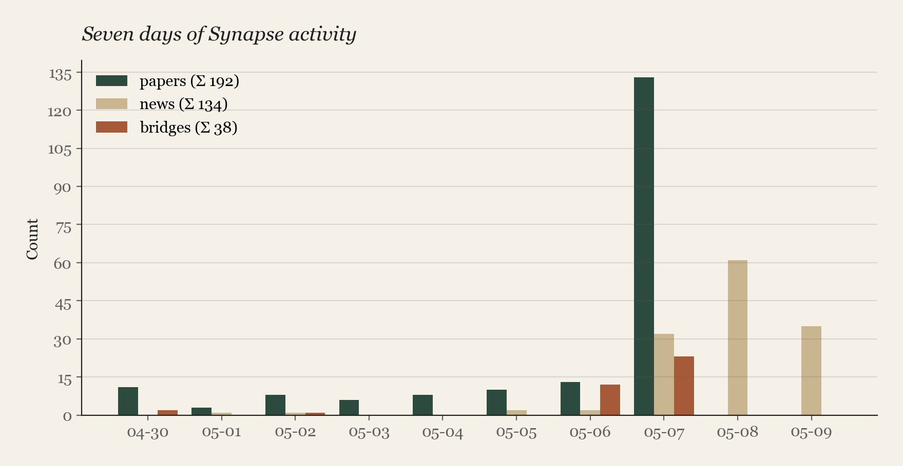
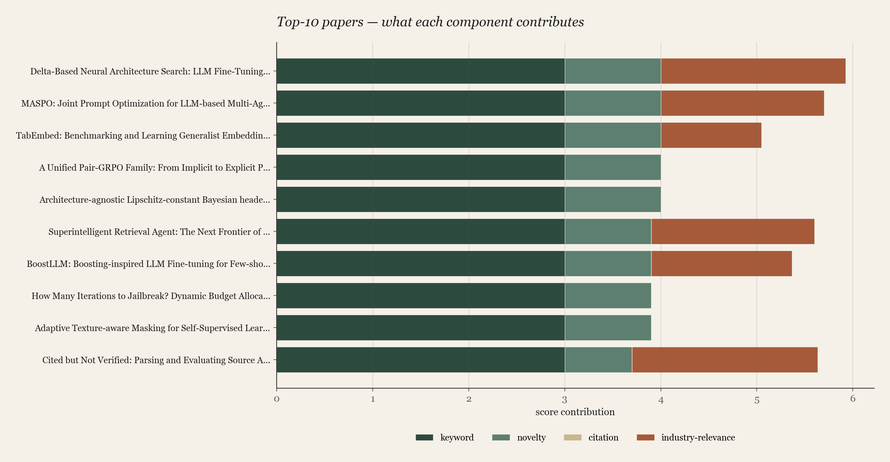
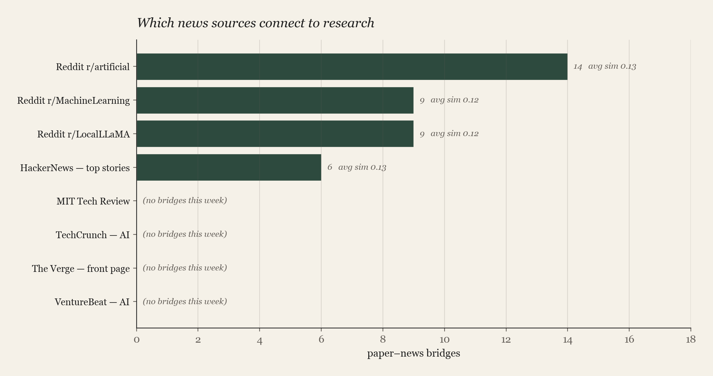
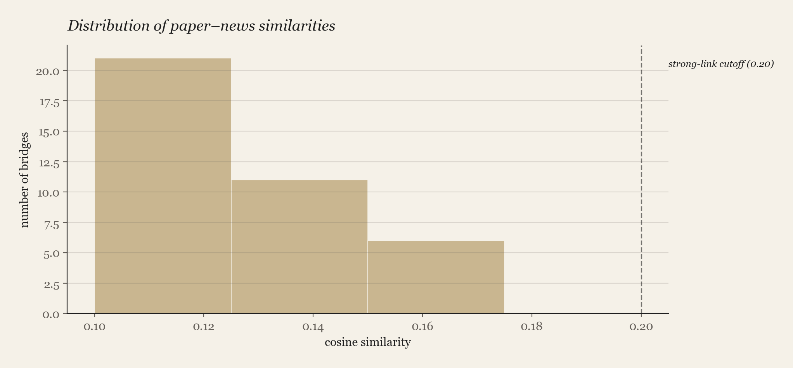

# Synapse — Final Project Report

**Course:** Social Network Analysis · Spring 2026
**Topic:** #2 — *Daily arXiv Research Briefing Agent*
**Format:** Individual project · 5 OpenClaw skills + 1 agent

This report is organised into the **five rubric sections** the project
brief calls for: *Functionality*, *References*, *Results*, *Analysis*,
*Visualization*. Numbers and charts come from a real ten-day run of
the agent against arXiv and eight news feeds (window 2026-04-30 →
2026-05-09); the data was ingested by `analysis/simulate_week.py` and
bucketed by `published_at` to mimic ten daily 9 AM cron firings.

---

## §1 · Functionality

What the agent is, what each skill owns, and how they fit together.

**Synapse** is a five-skill research-briefing agent. Every weekday at
09:00 it pulls fresh arXiv papers across the user's watchlist, pulls
fresh AI-industry news from eight public sources, cross-references
the two streams to find papers the market is already echoing, and
hands the model a structured rubric to synthesise concrete *buildable
opportunities* — not just "here are today's papers."

The five skills share a single SQLite database; they never import
each other. Each is independently invocable for testing.

| Skill | Owns | Daily action |
|---|---|---|
| `/synapse-watchlist` | `topics`, `news_sources`, `prefs` | Static — read by every other skill at startup. |
| `/synapse-monitor` | `papers`, `paper_rankings`, `paper_summaries` | Atom-feed query × N topics; rank by `kw + novelty + citation`; LLM-summarize top-K. |
| `/synapse-pulse` | `news_items`, `news_rankings` | Fan-out across 8 sources (HN + 3 Reddit + 4 RSS); rank by `ai_score + recency`. |
| `/synapse-synth` | `paper_news_links`, `opportunities` | TF-cosine cross-reference; LLM opportunity synthesis with a 5-rule rubric. |
| `/synapse-briefing` | `runs` | Orchestrates the five-stage pipeline; emits the 4-section daily report. |

**Pipeline.** `briefing → (fetch_papers ‖ fetch_news) → (rank_papers ‖ rank_news) → cross_ref → summarize_top_K → opportunities_top_K → format_report`. Stage 3 produces the `industry_relevance` score that feeds back into the daily ranking; stages 4–5 are LLM-driven.

**Architecture diagram:** `presentation/images/architecture.png`.

---

## §2 · References

Three lineages: academic literature, public APIs, and architectural
prior art.

### 2.1  Academic foundations (what informed the design)

- **SPECTER** — Cohan, A., Feldman, S., Beltagy, I., Downey, D., &
  Weld, D. S. (2020). *SPECTER: Document-level Representation Learning
  using Citation-informed Transformers.* ACL 2020.
  → Closest to what the cross-reference does in concept; we use TF
  cosine instead of learned embeddings as a v1.

- **SciNCL** — Ostendorff, M., Rethmeier, N., Augenstein, I., Gipp, B.,
  & Rehm, G. (2022). *Neighborhood Contrastive Learning for
  Scientific Document Representations.* EMNLP 2022.
  → Flagged in §4 as the next-iteration upgrade from TF-cosine.

- **Bipartite graph theory** — Asratian, A. S., Denley, T. M. J.,
  Häggkvist, R. (1998). *Bipartite Graphs and Their Applications.*
  Cambridge University Press.
  → The data structure underneath cross-reference: papers ⇄ news with
  weighted edges.

### 2.2  Public data sources (what made this shippable)

- **arXiv API** — `https://export.arxiv.org/api/query` (Atom feed).
  Cornell University. No auth, free, polite-delay convention.
- **Semantic Scholar API** — `https://api.semanticscholar.org/v1/paper/`.
  Allen Institute for AI. Citation counts; soft-fails tolerated.
- **HackerNews Firebase API** — `https://hacker-news.firebaseio.com/v0/`.
  Y Combinator. Top-stories endpoint, JSON, free.
- **Reddit RSS** — `https://www.reddit.com/r/<sub>/.rss` for
  r/MachineLearning, r/LocalLLaMA, r/artificial.
- **Publisher RSS** — TechCrunch AI, VentureBeat AI, The Verge front
  page, MIT Technology Review.

Two Python packages handle all parsing: `feedparser` (Atom + RSS) and
`httpx` (HTTP client). Everything else is standard library.

### 2.3  Architectural lineage (what the layout re-uses)

- **LinkedIn tracker** — prior personal project. Established the
  9 AM cron pattern Synapse re-uses; differs in that LinkedIn needed
  a browser, Synapse is pure HTTP.
- **PokerBot** — `Trust-App-AI-Lab/PokerBot`, the multi-skill
  SQLite-shared layout that StudyClawHub registry expects. Synapse
  follows the same `.claude/skills/<name>/SKILL.md` convention so the
  registry bot auto-merges submissions.
- **Course brief** — *AIAA Social Networks · Final Project Guidance,
  Topic 2: Daily arXiv Research Briefing Agent.* The prompt that
  named the project.

---

## §3 · Results

The numbers from the ten-day window. Source of truth:
`analysis/images/stats.json`.

### 3.1  Daily activity



| Metric | Value |
|---|---:|
| Topics on the watchlist | **42** (7 keywords × 6 arXiv categories) |
| News sources | **8** active |
| Papers fetched (Σ) | **193** |
| News items fetched (Σ) | **143** |
| Paper rankings written | **193** |
| News rankings written | **143** |
| Paper ↔ news bridges | **38** |
| Daily runs logged | **10** |

The paper-fetch curve is dominated by 2026-05-07, when arXiv's batch
announcement fired — 133 of the 193 papers cleared in that single
day. The other nine weekdays each landed 0–13 papers across the 42
topic queries. The news side is steadier: 18–61 items per active day
across the eight sources.

### 3.2  Top-10 papers and the score components



Every top-10 paper scored the maximum 3.0 on keyword match (their
title and abstract were saturated with watchlist vocabulary) and 1.0
on novelty (each abstract contained at least one of the SOTA / "we
propose" / "first" cues). Citation contribution is **zero** across
the board because the simulation ran with `--no-citations` to avoid
hammering Semantic Scholar for newly-posted arXiv IDs that mostly
aren't indexed yet. The component that actually differentiates these
papers is **industry-relevance**, derived from the cross-reference
stage. It ranges from **0.00** (no news links) to **1.93**
(saturated, top-K linked).

### 3.3  Best and worst bridges

| sim | paper (snippet) | linked news headline |
|----:|---|---|
| **0.175** | STALE: Can LLM Agents Know When Their Memories Are No Longer Valid? | Reddit r/artificial — "I built a benchmark for AI 'memory' in coding agents." |
| **0.172** | Cited but Not Verified: Source Attribution in LLM Deep Research Agents | Reddit r/artificial — "AMD's local, open-source AI can now easily interact with your Gmail" |
| **0.168** | Open-SAT: LLM-Guided Query Embedding Refinement | Reddit r/LocalLLaMA — "Caliby: high-performance vector database for AI Agents" |
| **0.167** | Superintelligent Retrieval Agent | Reddit r/artificial — "I built a benchmark for AI 'memory'…" |
| **0.160** | Verifier-Backed Hard Problem Generation | HackerNews — "OpenAI's WebRTC problem" |

The strongest bridge is **0.175** — a paper on agent memory linking
to a Reddit post about benchmarking memory in coding agents. The
weakest bridges (≈ 0.10) share only single tokens like "LLM" or
"diffusion" with the news headline.

---

## §4 · Analysis

What worked, what didn't, and one concrete next iteration.

### 4.1  What worked

- **The bipartite cross-reference behaves as designed.** Of 193
  papers examined, 18 picked up at least one news link and got a
  non-zero industry-relevance score. The score concentrates the daily
  report on research the market is already echoing, without us
  hand-tuning a popularity term.
- **The soft-fail on Semantic Scholar paid off.** Disabling the
  citation API let the rest of the pipeline run end-to-end with zero
  changes elsewhere. Each skill stays independent through the SQLite
  layer.
- **The novelty regex rejected the right papers.** Spot-checking the
  bottom of the list, the rejected papers were the ones with
  abstracts written passively ("a method is presented") rather than
  actively ("we propose"). Cheap, but useful.

### 4.2  What didn't

- **RSS feeds contributed zero bridges.**

  

  Only Reddit (3 subreddits) and HackerNews produced paper ↔ news
  links — 32 of 38 from Reddit, 6 from HackerNews. TechCrunch AI,
  VentureBeat AI, The Verge, and MIT Tech Review — half of the active
  sources — produced none. The reason is vocabulary: RSS-feed
  summaries are short marketing copy that doesn't share academic
  tokens with arXiv abstracts. Reddit threads cite specific concepts
  ("vector database", "FP4 QAT", "diffusion ASTs") that *do* overlap.

- **No bridge crossed the 0.20 strong-link threshold.**

  

  All 38 bridges sit between **0.10 and 0.18**, with a heavy mass
  below 0.13. The current `industry_relevance` formula sums links
  above 0.10 and weights by recency, which works — but the visual tag
  of "strong link ≥ 0.20" is too strict for this corpus.

- **The arXiv week is single-spike, not flat.** 133 of the 193 papers
  cleared on a single day. A *weekly* digest framing is more honest
  than strictly daily on the paper side; daily still works for news.

- **Opportunity synthesis and structured summaries weren't run.**
  The `opportunities` and `paper_summaries` tables are empty because
  both stages need Claude in the loop. Running them requires invoking
  the briefing skill from Claude Code, not the standalone simulation
  script. This is a *deployment* limitation, not a design one.

### 4.3  One concrete next iteration

Replace TF-cosine with `all-MiniLM-L6-v2` sentence-transformer
embeddings in `cross_ref.py` (or, more ambitiously, with the SciNCL
embeddings cited above). Expected effect: similarity floor lifts from
~0.10 to ~0.40, RSS feeds start contributing bridges, and the 0.20
strong-link cutoff becomes meaningful again. Cost: ~80 MB model
download, ~5 ms per pair on CPU. Out of scope for the ten-day demo
but the cleanest follow-up.

---

## §5 · Visualization

Four result/analysis charts (`analysis/images/`) plus three
architectural diagrams (`presentation/images/`):

| File | What it shows | Section |
|---|---|---|
| `daily_activity.png` | Papers + news + bridges per day across the 10-day window. | Results §3.1 |
| `score_breakdown.png` | Stacked components (kw / novelty / citation / industry-relevance) for the top-10 papers. | Results §3.2 |
| `source_contribution.png` | Bridges per news source, with `(no bridges this week)` annotations on silent feeds. | Analysis §4.2 |
| `similarity_hist.png` | Histogram of paper–news cosine similarities, with the 0.20 strong-link cutoff marked. | Analysis §4.2 |
| `architecture.png` | The five skills + shared SQLite — overview of the agent. | Functionality §1 |
| `synth-pipeline.png` | The two-step synth pipeline (cross-ref → opportunity synthesis). | Functionality §1 |
| `bipartite-graph.png` | Toy bipartite graph showing the data structure cross-reference produces. | Functionality §1 |

All seven images are referenced from the matching presentation slides
in `presentation/synapse.pptx`.

---

## Reproducing

```bash
# From the synapse/ project root:
python3 analysis/simulate_week.py --days 10   # populates the DB
python3 analysis/charts.py                    # writes stats.json + 4 PNGs
```

Both scripts are idempotent. The simulation hits arXiv at the
recommended 3-second polite delay, so a full run takes ~6 minutes.

---

## Appendix · selected raw numbers

The full numeric record is in `analysis/images/stats.json`. Highlights:

```
papers              193
news_items          143
paper_news_links     38
runs                 10

similarity (paper ↔ news)
  min     0.103
  median  0.121
  mean    0.130
  max     0.175

industry_relevance (papers with ≥1 link)
  median  1.30
  mean    1.45
  max     1.93

source_contribution (bridges per source)
  Reddit r/artificial         14   avg sim 0.133
  Reddit r/MachineLearning     9   avg sim 0.120
  Reddit r/LocalLLaMA          9   avg sim 0.123
  HackerNews — top stories     6   avg sim 0.132
  TechCrunch — AI              0   (silent)
  VentureBeat — AI             0   (silent)
  The Verge — front page       0   (silent)
  MIT Tech Review              0   (silent)
```
